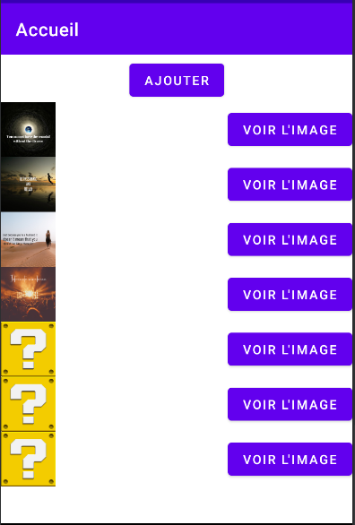
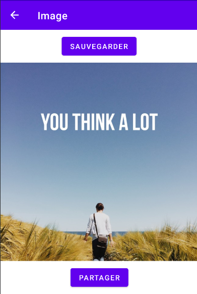

# F1_CANTE_CATINON
    
TP Noté d'Android pour la PAM
    

Notre application a pour but de récupérer des images depuis internet générer par une IA (inspiroBot)

Elle possède 2 écrans :
- Le premier est l’écran d’accueil ou vous pouvez voir les images que vous avez sauvegarder et en générer de nouvelle grâce au bouton « Ajouter »
	
- Le deuxième écran apparait quand on appuie sur un des éléments du premier écran et sert à afficher une image qu’on pourra ensuite sauvegarder pour une prochaine ouverture a l’aide du bouton « Sauvegarder » ou bien partager cette image grâce au bouton « Partager » 

    
    

 
Développeurs :

    - CANTE Théo
    - CATINON Audric

Professeurs :

	- COULANGE Thomas 
	- GOUTET Olivier 